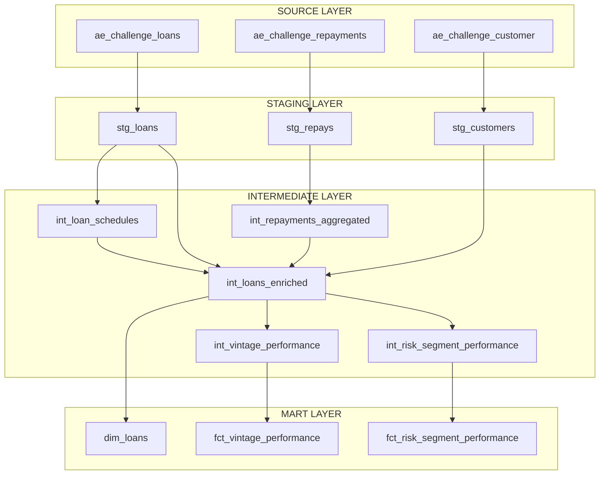

# KueskiPay Portfolio Analytics - dbt Project

## Project Overview

This dbt project implements a layered data architecture for analyzing KueskiPay's loan portfolio performance. 

## Architecture Layers



## Model Details

### Staging Layer (`models/staging/`)

| Model | Description | Materialization |
| --- | --- | --- |
| `stg_loans` | Loan snapshots with JSON schedule and status history | Incremental |
| `stg_repays` | Cleaned repayment transactions | Incremental |
| `stg_customers` | Customer demographics and acquisition costs | Incremental |

### Intermediate Layer (`models/intermediate/`)

| Model | Description | Materialization |
| --- | --- | --- |
| `int_loan_schedules` | Flattened repayment schedules derived from `stg_loans` JSON | Incremental |
| `int_repayments_aggregated` | Repayments aggregated to the loan level | Incremental |
| `int_loans_enriched` | The "Golden Record" joining loans, schedules, repayments, and customers | Incremental |
| `int_vintage_performance` | Aggregated metrics grouped by vintage month | Table |
| `int_risk_segment_performance` | Aggregated metrics grouped by risk segment | Table |

### Mart Layer (`models/marts/`)

| Model | Description | Materialization |
| --- | --- | --- |
| `dim_loans` | Loan dimension view for detailed loan-level analysis | View |
| `fct_vintage_performance` | Vintage performance facts view | View |
| `fct_risk_segment_performance` | Risk segment performance facts view | View |

## Key Metrics Calculated

### Financial Metrics

* **Revenue** = Interest + Fees + Penalties
* **Financial Margin** = Revenue - Charge-offs
* **Contribution Margin** = Financial Margin - COGS
* **Net Margin** = Contribution Margin - CAC

### Collection Metrics

* **Principal Collection Rate** = Paid Principal / Expected Principal
* **Interest Collection Rate** = Paid Interest / Expected Interest
* **Expected Yield Rate** = Expected Interest / Funded Amount
* **Actual Yield Rate** = Paid Interest / Funded Amount
* **Yield Gap** = Expected Yield - Actual Yield

### Risk Metrics

* **Loss Rate** = Charge-offs / Funded Amount
* **NPL Rate** = NPL Balance / Total Balance (Flagged when DPD > 90 or Charged Off)

## Data Lineage

```text
stg_loans ──┬──► int_loan_schedules ──┐
            │                         │
stg_repays ─┴──► int_repayments_aggregated ──┼──► int_loans_enriched ──┬──► dim_loans
                                             │                         │
stg_customers ───────────────────────────────┘                         ├──► int_vintage_performance ──► fct_vintage_performance
                                                                       │
                                                                       └──► int_risk_segment_performance ──► fct_risk_segment_performance

```

## Configuration

* **Staging & Intermediate:** Configured as `incremental` with `merge` strategy to handle large transaction volumes efficiently.
* **Marts:** Configured as `view` to provide a lightweight presentation layer over the pre-aggregated intermediate tables.
* **Partitioning:** Date-based partitioning enabled on large tables.
* **Clustering:** Key fields (user_id, loan_id, vintage_month) clustered for query performance.

## Testing

Each model includes:

* `unique` tests for primary keys
* `not_null` tests for required fields
* `relationships` tests for foreign keys

```

```
